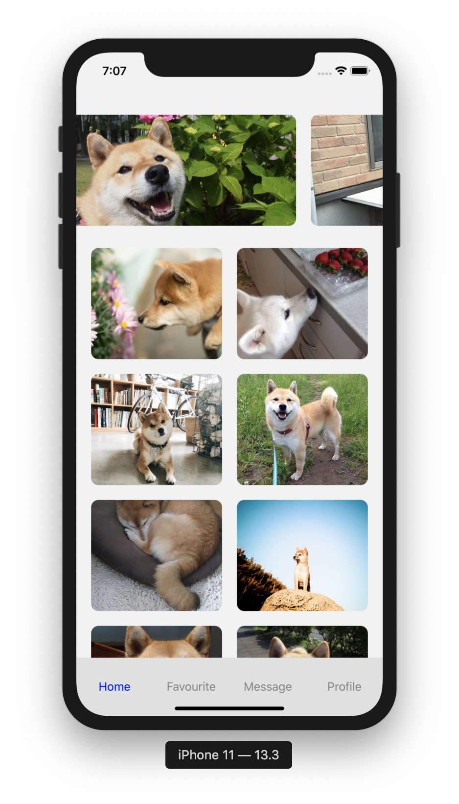

# Prodigy


A demo integration of publically available [Random Images](http://shibe.online/api/shibes?count=50&urls=true&httpsUrls=true) API in React Native.

  - Contains a carousel of Images on top of home screen and vertical grid list of 2 columns .
  - Bottom navigation with four tabs. (Home screen should be first tab)

### Steps to run

Install the dependencies and start the metro server.

```sh
$ cd Prodigy
$ npm install
$ npm run start
```

Open new terminal window with current directory.

#### For running app in iOS Simulator ...

```sh
$ cd ios
$ pod install
$ npm run ios
```

#### For running app on Android device ...

Connect device( make sure USB debugging is enabled ) or launch an emulator.

```sh
$ npm run android
```


